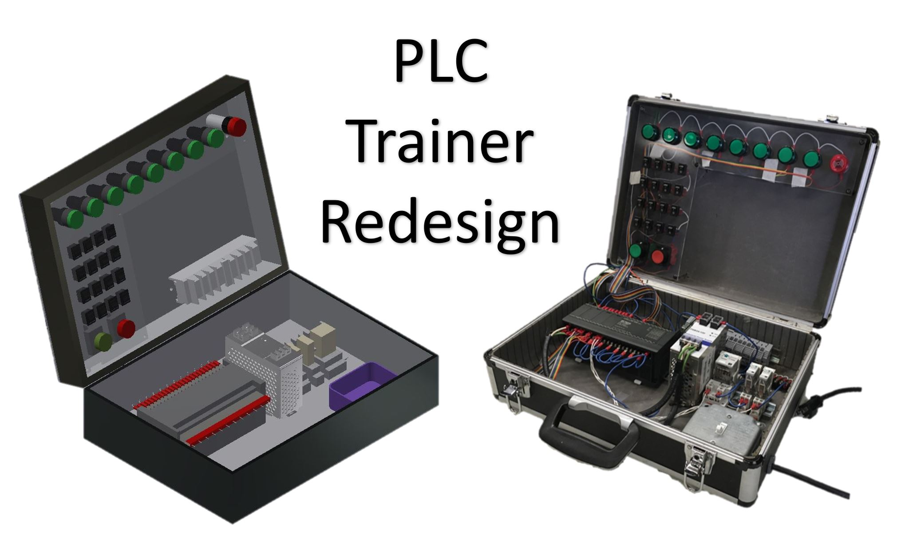

My senior project for high school was to repackage ten plus programmable logic controllers (PLCs) because the school was changing locations and would not have room for the 3x2x3.5 foot PLC board the engineering program currently used to teach juniors ladder logic and programming. 

Through the project, I learned how to meet client needs, converse with experts to update the schematics, utilize CAD and other prototyping methods, use a laser engraver and various tools, and document each step to easily communicate to other how to replicate my work.

In the end, I created a less space-consuming a portable project that had simplified cabling and updated electrical codes. I also helped my school save $10,000+ if they had been forced to buy new PLC boards.

You can list [links](https://www.hashicorp.com/resources/test-driven-development-tdd-for-infrastructure)
or even embed images with the following Markdown:

